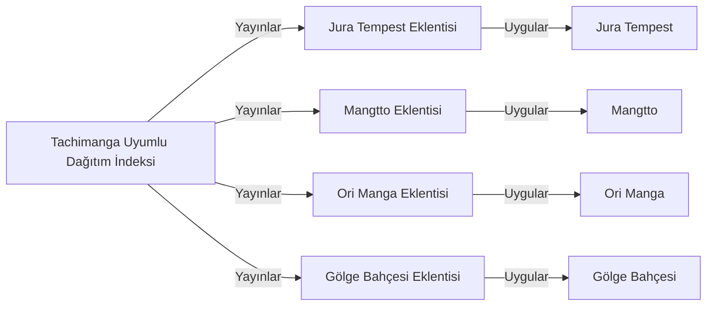

# Tachimanga Türkçe Manga Uzantı Deposu — Ontoloji

Revizyon: 19. Canlı görünüm için `ontology` komutunu çalıştır.

## Türler ve özellikler

### Hedef Kaynak Site (`source_site`)

- domain: string; zorunlu; seçenekler: None
- status: string; zorunlu; seçenekler: ['active', 'broken', 'investigating']
- engine: string; zorunlu; seçenekler: ['solidstart_ssr', 'nextjs_api', 'wordpress_initmanga', 'nextjs_encrypted']
### Eklenti Modülü (`extension_module`)

- pkg: string; zorunlu; seçenekler: None
- version_code: integer; zorunlu; seçenekler: None
### Depo İndeksi (`repo_index`)

- status: string; zorunlu; seçenekler: ['pending', 'generated', 'published']

## İlişki kuralları

- Uygular (`implements`): extension_module → source_site; kaynak başına 1..1, hedef başına 0..çok; etki: reverse
- Yayınlar (`publishes`): repo_index → extension_module; kaynak başına 1..çok, hedef başına 1..1; etki: reverse

## Somut nesneler

- **Jura Tempest** (`site-juratempest`, source_site): {"domain": "juratempe.st", "engine": "solidstart_ssr", "status": "active"}; durum: input; üretici: dış girdi
- **Mangtto** (`site-mangtto`, source_site): {"domain": "mangtto.com", "engine": "nextjs_api", "status": "active"}; durum: input; üretici: dış girdi
- **Ori Manga** (`site-orimanga`, source_site): {"domain": "orimanga.net", "engine": "wordpress_initmanga", "status": "active"}; durum: input; üretici: dış girdi
- **Gölge Bahçesi** (`site-golgebahcesi`, source_site): {"domain": "golgebahcesi.com", "engine": "nextjs_encrypted", "status": "active"}; durum: input; üretici: dış girdi
- **Jura Tempest Eklentisi** (`ext-juratempest`, extension_module): {"pkg": "eu.kanade.tachiyomi.extension.tr.juratempest", "version_code": 1}; durum: current; üretici: T-JURATEMPEST
- **Mangtto Eklentisi** (`ext-mangtto`, extension_module): {"pkg": "eu.kanade.tachiyomi.extension.tr.mangtto", "version_code": 1}; durum: current; üretici: T-MANGTTO
- **Ori Manga Eklentisi** (`ext-orimanga`, extension_module): {"pkg": "eu.kanade.tachiyomi.extension.tr.orimanga", "version_code": 1}; durum: current; üretici: T-ORIMANGA
- **Gölge Bahçesi Eklentisi** (`ext-golgebahcesi`, extension_module): {"pkg": "eu.kanade.tachiyomi.extension.tr.golgebahcesi", "version_code": 1}; durum: current; üretici: T-GOLGEBAHCESI
- **Tachimanga Uyumlu Dağıtım İndeksi** (`release-index`, repo_index): {"status": "pending"}; durum: current; üretici: T-INIT

## Nesne haritası

Oklar kayıtlı ilişki yönüdür; değişiklik etkisinin yönü üstte ayrıca tanımlıdır.

## Görevlerin veri bağları

- **T-INIT — Proje ve Gradle repository çatısını kur**: girdiler [], çıktılar [release-index], durum done.
- **T-JURATEMPEST — Jura Tempest uzantısını geliştir**: girdiler [site-juratempest], çıktılar [ext-juratempest], durum done.
- **T-MANGTTO — Mangtto uzantısını geliştir ve API parametrelerini düzelt**: girdiler [site-mangtto], çıktılar [ext-mangtto], durum done.
- **T-ORIMANGA — Ori Manga uzantısını geliştir**: girdiler [site-orimanga], çıktılar [ext-orimanga], durum done.
- **T-GOLGEBAHCESI — Gölge Bahçesi uzantısını geliştir ve kilitli bölümleri filtrele**: girdiler [site-golgebahcesi], çıktılar [ext-golgebahcesi], durum done.
- **T-REPO-BUILD — Repository indeks ve APK derleme mantığını kur**: girdiler [ext-juratempest, ext-mangtto, ext-orimanga, ext-golgebahcesi], çıktılar [], durum done.
- **T-GITHUB-CI — GitHub Actions CI iş akışını ve GitHub repo senkronizasyonunu kur**: girdiler [release-index], çıktılar [], durum doing.

Etki yeniden inceleme ihtiyacıdır; nesnenin yanlış olduğu hükmü değildir.
